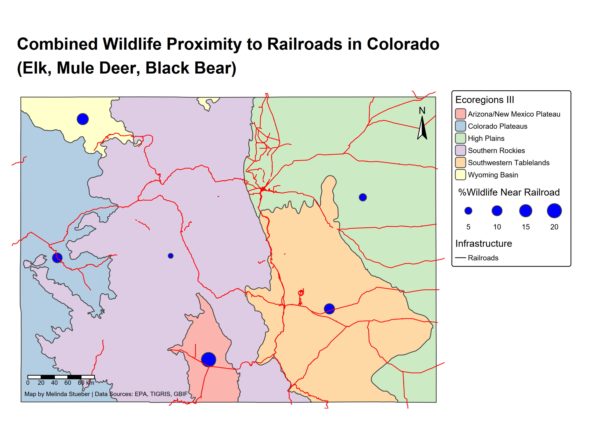

# Coding and Mapping, Oh My!

Here is a sample of my blood sweat and tears🩸. I don't want to shock you, but this is a student sample, emphasis on **student**. This was a challenging project as much of my experience coding has focused on data analysis without any of the geo-spatial pizzazz. 💥.

I wanted to look at railroads, eco-regions, and wildlife hot-spots around railroads in Colorado for this assignment I did for ESS523A. 


This is a setup script I was taught to have and use throughout my projects. It is super helpful because then you don't have to continually tell R to "please load these eight billion packages I need by name". Just put the setup into a Rscript and save it as setup.R and off you go! 

# Set up script

function to check for package installation, then install and load libraries.

```{r, eval=FALSE}
packageLoad <-
  function(x) {
    for (i in 1:length(x)) {
      if (!x[i] %in% installed.packages()) {
        install.packages(x[i])
      }
      library(x[i], character.only = TRUE)
    }
  }
```


vector of packages to load
```{r, eval=FALSE}
packages <- c('tidyverse',
              'palmerpenguins',
              'sf',
              'terra',
              'tmap',
              'rmarkdown',
              'tigris',
              'elevatr',
              'rgbif',
              'soilDB',
              'plotly',
              'mapview',
              "leaflet")

packageLoad(packages)
```


First I actually needed to get data for roads (Vector Data).

```{r, eval=FALSE}
source("setup.R")
rails <- rails()
CO_boundary <- states() %>% filter(STUSPS == "CO")
CO_rails <- st_filter(rails, CO_boundary)

ggplot() +
  geom_sf(data = CO_rails)

```

Next I needed to get data for Colorado Ecoregions (Vector Data).

```{r, eval=FALSE}
CO_ecoregions <- st_read("C:/Users/melin/Geospatial/co_eco_l3/co_eco_l3.shp")
#Map came out tilted so need to transform to different CSR
CO_ecoregions_prj <- st_transform(CO_ecoregions, st_crs(CO_rails))

ggplot() +
  geom_sf(data = CO_ecoregions_prj, aes(fill = US_L3NAME)) +
  geom_sf(data = CO_rails) +
  theme_minimal() +
  labs(title = "Colorado Ecoregions Map")

```

 And then I needed to obtain data for migratory animals (Mule Deer, Elk, Black Bear).

```{r, eval=FALSE}
#make a string of species names to use in the 'occ_data' function
species <- c("Cervus canadensis", "Odocoileus hemionus", "Ursus americanus")

#also make a string of common names
common_name <- c("Elk", "Mule Deer", "Black Bear")

#map2
species_occ <-function(sci_name, comm_name){
t_occ <-
    occ_data(
      scientificName = sci_name,
      hasCoordinate = TRUE,
      geometry = st_bbox(CO_ecoregions_prj),
      limit = 2000 
    ) %>%
    .$data 
  
  t_occ$ID <- comm_name
  
  t_occ <-
    t_occ %>% distinct(decimalLatitude, decimalLongitude, .keep_all = TRUE) %>%
    dplyr::select(Species = ID,
                  decimalLatitude,
                  decimalLongitude,
                  year,
                  month,
                  basisOfRecord) 
return(t_occ)
}

output_species <- purrr::map2(species, common_name, species_occ)

occ <- bind_rows(output_species) %>% 
  st_as_sf(coords = c("decimalLongitude", "decimalLatitude"), crs = 4236)

occ_prj <- st_transform(occ, st_crs(CO_ecoregions_prj))


```

Next, compile the data.

```{r, eval=FALSE}

#make data more manageable, group by ecoregions and distance to railroad
railroad_buffer <- st_buffer(CO_rails, dist = 500)
occ_prj$railroad_intersections <- st_intersects(occ_prj, railroad_buffer)


#join data
eco_rail_occ <- st_join(occ_prj, CO_ecoregions_prj) %>%
  mutate(near_rails_500m = if_else(lengths(railroad_intersections) == 0, FALSE, TRUE))

#summarize
all_sum <- eco_rail_occ %>% 
  st_drop_geometry() %>%
  group_by(US_L3NAME) %>% 
  summarise(total_occ = n(), 
            total_railroad = sum(near_rails_500m == TRUE),
            percent_railroad = (sum(near_rails_500m == TRUE)/total_occ)*100, .groups = "drop") %>%
  filter(!is.na(US_L3NAME))
class(all_sum)

eco_spatial <- CO_ecoregions_prj %>%
  inner_join(all_sum, by = "US_L3NAME")

```

# Map Data

```{r, eval=FALSE}

tmap_mode("plot")

map <-tm_shape(CO_ecoregions_prj) +
  tm_polygons(fill = "US_L3NAME", fill.scale = tm_scale_categorical(values = "brewer.pastel1"),
              fill.legend = tm_legend(title = "Ecoregions III")) +
tm_shape(eco_spatial) +
  tm_bubbles(size = "percent_railroad",
             fill = "blue",
             size.legend = tm_legend(title = " %Wildlife Near Railroad", orientation = "landscape")) +
tm_shape(CO_rails) +
  tm_lines(col = "red") +
  tm_add_legend(labels = "Railroads", type = "lines", col = "black", title = "Infrastructure") +
tm_title(
  "Combined Wildlife Proximity to Railroads in Colorado\n(Elk, Mule Deer, Black Bear)", size = 1.5, fontface = "bold", position = tm_pos_out("center", "top")) +
  tm_layout(frame = FALSE, 
            legend.outside = TRUE,
            legend.outside.position = "right",
            legend.outside.size = 0.3,
            legend.text.size = .6,
            legend.title.size = .8) +
  tm_scalebar(position = c("left", "bottom")) +
  tm_compass(position = c("right", "top")) +
  tm_credits("Map by Melinda Stueber | Data Sources: EPA, TIGRIS, GBIF", position = c("left", "bottom"), size = 0.5, color = "black") 

map
tmap_save(map, "C:/Users/melin/Geospatial/Rails_Wildlife_CO_map.png")
```



So if you've learned anything, know that if I can code, you can too! We are all learning, it is part of the fun, sometimes anger-inducing, process of R. 